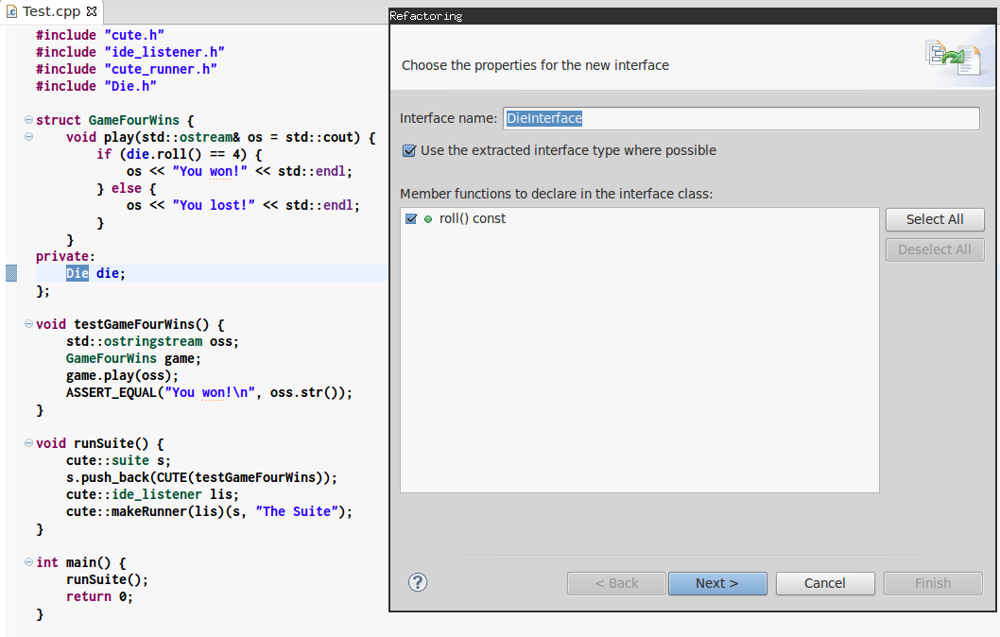
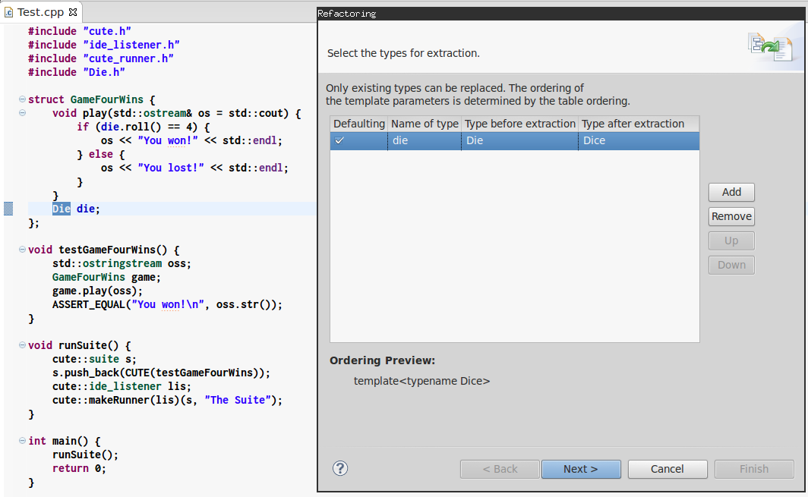
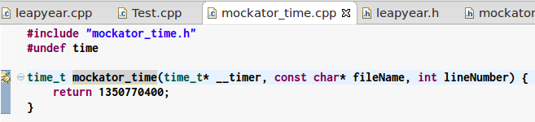
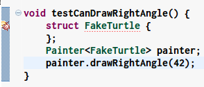
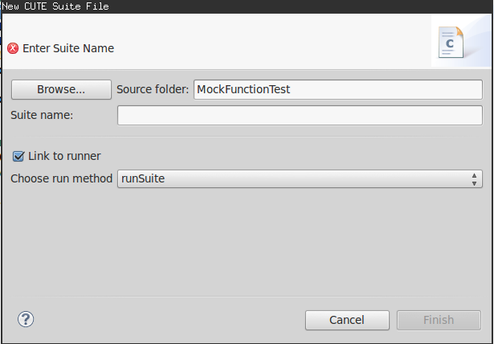

% Mockator User Manual
% Michael Rüegg
% 18.03.2014

# Introduction
Breaking dependencies is an important task in refactoring legacy
code and putting this code under tests. Feathers' seams (@legacycode) help us
here because they enable us to inject dependencies from
outside. Although seams are a valuable technique, it is hard and
cumbersome to apply them without automated refactorings and tool
chain configuration support. We provide sophisticated support for
seams with Mockator a plug-in for the Eclipse C/C++ development
tooling project. Mockator creates the boilerplate code and the necessary
infrastructure for the four seam types object, compile, preprocessor
and link seam.

Although there are already various existing mock object libraries for
C++, we believe that creating mock objects is still too complicated
and time-consuming for developers. Mockator provides a mock object
library and an Eclipse plug-in to create mock objects in a simple yet
powerful way. Mockator leverages the new language facilities C++11
offers while still being compatible with C++98/03.


# Seams
High coupling, hard-wired and cyclic dependencies lead to systems that
are hard to change, test and deploy in isolation. Unfortunately, legacy
code often has these attributes. Feathers' seam model helps
us in recognising opportunities to inject dependencies from
outside, thus getting rid of fixed dependencies. There are different
kinds of seam types. In C++ we have object, compile, preprocessor
and link seams which are discussed by using Mockator in the following sections.


## Object Seams
Object seams are probably the most common seam type. To start with an example,
consider the following code where the class ``GameFourWins`` has a hard coded
dependency to ``Die`` (@dieexample):

```cpp
// Die.h
struct Die {
  int roll() const ;
};
// Die.cpp
int Die::roll() const {
  return rand() % 6 + 1;
}
// GameFourWins.h
struct GameFourWins {
  void play(std::ostream& os);
private:
  Die die;
};
// GameFourWins.cpp
void GameFourWins::play(std::ostream& os = std::cout) {
  if (die.roll() == 4) {
    os << "You won!" << std::endl;
  } else {
    os << "You lost!" << std::endl;
  }
}
```

According to Feathers definition, the call to ``play`` is not a seam because it is
missing an enabling point. We cannot alter the behaviour of the member function
``play`` without changing its function body because the used member variable ``die``
is based on the concrete class ``Die``. Furthermore, we cannot subclass
``GameFourWins`` and override ``play`` because ``play`` is monomorphic
(not virtual).

This fixed dependency also makes ``GameFourWins`` hard to test in isolation
because ``Die`` uses C's standard library pseudo-random number generator
function ``rand``. Although ``rand`` is a deterministic function since calls
to it will return the same sequence of numbers for any given seed, it is hard
and cumbersome to setup a specific seed for our purposes. The classic way to
alter the behaviour of ``GameFourWins`` is to inject the dependency from outside.
The injected class inherits from a base class, thus enabling subtype
polymorphism. 

To achieve an object seam, the first step is to extract an interface. For this,
Mockator provides a new refactoring called *Extract Interface*. Select the class
to extract an interface from (e.g., ``Die``) and click "Refactor->Extract Interface"
(see figure \ref{extract_interface}).



As a result, a new interface with pure virtual member functions is created:

```cpp
struct IDie {
  virtual ~IDie() {}
  virtual int roll() const =0;
};
struct Die : IDie {
  int roll() const {
    return rand() % 6 + 1;
  }
};
struct GameFourWins {
  GameFourWins(IDie& die) : die(die) {}
  void play(std::ostream& os=std::cout) {
    // as before
  }
private:
  IDie& die;
};
```

This way we can now inject a different kind of ``Die`` depending on the context
we need. This is a seam because we now have an enabling point: The instance
of ``Die`` that is passed to the constructor of ``GameFourWins``.


## Compile Seams
Although object seams are the classic way of injecting dependencies, we think
there is often a better solution to achieve the same goals. C++ has a tool
for this job providing static polymorphism: template parameters. With template
parameters, we can inject dependencies at compile-time. We therefore call this
seam compile seam.

The use of static polymorphism with template parameters has several advantages
over object seams with subtype polymorphism. It does not incur the run-time
overhead of calling virtual member functions that can be unacceptable for
certain systems. Probably the most important advantage of using templates is
that a template argument only needs to define the members that are actually
used by the instantiation of the template (providing compile-time duck typing).
This can ease the burden of an otherwise wide interface that one might need to
implement in case of an object seam.


The essential step for this seam type is the application of a the refactoring
*Extract Template Parameter* through the menu "Refactor->Extract Template"
(see figure \ref{extract_template}) which comes with the Cute plug-in (@cute).



The result of this refactoring can be seen here:

```cpp
template <typename Dice=Die>
struct GameFourWinsT {
  void play(std::ostream& os = std::cout) {
    if (die.roll() == 4) {
      os << "You won !" << std::endl;
    } else {
      os << "You lost !" << std::endl;
    }
  }
private:
  Dice die;
};
typedef GameFourWinsT<> GameFourWins;
```

The enabling point of this seam is the place where the template class 
``GameFourWinsT`` is instantiated.

## Preprocessor Seams
C and C++ offer another possibility to alter the behaviour of code without
touching it in that place using the preprocessor. Although we are able to
change the behaviour of existing code as shown with object and compile seams
before, we think preprocessor seams are especially useful for debugging
purposes like tracing function calls. An example of this is shown next where
we trace calls to C's ``time`` function with the help of Mockator:

```cpp
/* leapyear.h */

#ifndef TODAYSTIME_H_
#define TODAYSTIME_H_

bool isLeapYear();

#endif /* TODAY_H_ */
```

```cpp
/* leapyear.cpp */

#include "leapyear.h"
#include <ctime>

unsigned int thisYear() {
    time_t now = time(0);
    tm* z = localtime(&now);
    return z->tm_year + 1900;
}

bool isLeapYear() {
    unsigned int year = thisYear();
    if ((year % 400) == 0) {
        return true;
    }
    if ((year % 100) == 0) {
        return false;
    }
    if ((year % 4) == 0) {
        return true;
    }
    return false;
}
```

```cpp
/* Test.cpp */

#include "cute.h"
#include "ide_listener.h"
#include "cute_runner.h"
#include "leapyear.h"

void testLeapYear() {
    ASSERT(isLeapYear());
}

void runSuite(){
    cute::suite s;
    s.push_back(CUTE(testLeapYear));
    cute::ide_listener lis;
    cute::makeRunner(lis)(s, "The Suite");
}

int main(){
    runSuite();
    return 0;
}
```

To do this, select the function call for ``time`` and execute the source action
"Source->Trace Function Call" (Ctrl+Alt+R). Now one can toggle the activation
of this feature within the resolution of an Eclipse quickfix marker
(see figure \ref{trace_function_call}).



The enabling point for this seam are the options of our compiler to choose
between the real and our tracing implementation. We use the option 
``-include`` of the GNU compiler here to include the header file
``mockator_time.h`` into every translation unit. With ``#undef`` we are still
able to call the original implementation of ``time``.


## Link Seams
Beside the separate preprocessing step that occurs before compilation, we also
have a post-compilation step called linking in C and C++ that is used to 
combine the results the compiler has emitted. The linker gives us another
kind of seam called link seam. We show three kinds of link seams here:

* Shadowing functions through linking order (override functions in libraries
with new definitions in object files)
* Wrapping functions with GNU's linker option -wrap (GNU Linux only)
* Run-time function interception with the preload functionality of the dynamic
linker for shared libraries (GNU Linux and Mac OS X only)


### Shadow Functions
In this type of link seam we make use of the linking order. The linker
incorporates any undefined symbols from libraries which have not been defined
in the given object files. If we pass the object files first before the
libraries with the functions we want to replace, the GNU linker prefers them
over those provided by the libraries. Note that this would not work if we
placed the library before the object files. In this case, the linker would take
the symbol from the library and yield a duplicate definition error when
considering the object file. Mockator helps in shadowing functions and
generates code and the necessary CDT build options to support this kind of 
link seam.

Consider the following code which is part of a static library project in CDT:

```cpp
#include "Die.h"
#include <cstdlib>

int Die::roll() const {
    return rand() % 6 + 1;
}
```

The unit test for this static library project is located in a CUTE library
project. If we select the function call to ``rand`` and choose the source action
"Source->Shadow function" (Ctrl+Alt+A), Mockator creates the following code
which is located in a new source folder ``shadows`` as can be seen in figure 
\ref{shadow_function}.


```cpp
#include <cstdlib>

int rand(void) {
    return int{};
}
```

In this translation unit, we can specify our implementation which shadows the
function in the translation unit of the static library.


This works by altering the Eclipse build settings to use our object file
first before the static library when calling the GNU linker:

```
$ ar -r libGame.a Die.o
$ g++ -L/path/to/GameLib -o Test cute_test.o rand.o -lGame
```

The order given to the linker is exactly as we need it to prefer the symbol
in the object file since the library comes at the end of the list. 
This list is the enabling point of this kind of link seam. If we leave
``rand.o`` out, the original version of ``rand`` is called as defined in the
static library ``libGame.a``. This type of link seam has one big disadvantage:
it is not possible to call the original function anymore. This would be
valuable if we just want to wrap the call for logging or analysis purposes
or do something additional with the result of the function call.


### Wrap Functions
The GNU linker ld provides a lesser-known feature which helps us to call the
original function. This feature is available as a command line option called
``-wrap``. The man page of ld describes its functionality as follows: 

> Use a wrapper function for symbol. Any undefined reference to symbol will
> be resolved to \_\_wrap_symbol. Any undefined reference to \_\_real_symbol will
> be resolved to symbol."

As an example, we compile ``GameFourWins.cpp``. If we study the symbols of the
object file, we see that the call to ``Die::roll`` -  mangled as
``_ZNK3Die4rollEv`` according to Itanium's Application Binary Interface (ABI)
that is used by GCC v4.x — is undefined (``nm`` yields ``U`` for
undefined symbols):

```cpp
$ gcc -c GameFourWins.cpp -o GameFourWins.o
$ nm GameFourWins.o | grep roll
U _ZNK3Die4rollEv
```

This satisfies the condition of an undefined reference to a symbol. Thus we can
apply a wrapper function here. Note that this would not be true if the
definition of the function ``Die::roll`` would be in the same translation unit
as its calling origin. If we now define a function according to the specified
naming schema ``__wrap_symbol`` and use the linker flag ``-wrap``, our function
gets called instead of the original one.

Mockator helps in applying this seam type by creating the necessary code and
the corresponding build options in Eclipse CDT. To use it, selection the
to be wrapped function call and click the source action "Source->Wrap Function"
(Ctrl+Alt+W). Mockator then creates the code as shown in figure 
\ref{shadow_function}. Mockator also provides an Eclipse marker beside the
wrapped function block which allows us to enable/disable and delete the wrapped
function.


The linker call used for this link seam looks as follows:

```
$ g++ -Xlinker -wrap=_ZNK3Die4rollEv -o Test test.o GameFourWins.o Die.o
```

To prevent the compiler from mangling the mangled name again, we need to define
it in a C code block. Note that we also have to declare the function
``__real_symbol`` which we delegate to in order to satisfy the compiler. The
linker will resolve this symbol to the original implementation of ``Die::roll``.

Alas, this feature is only available with the GNU tool chain on Linux. GCC for
Mac OS X does not offer the linker flag ``-wrap``. A further constraint is
that it does not work with inline functions but this is the case with all link
seams presented here. Additionally, when the function to be wrapped is part of
a shared library, we cannot use this option.


### Intercept Functions
If we have to intercept functions from shared libraries, we can use this kind
of link seam. It is based on the fact that it is possible to alter the run-time
linking behaviour of the loader ld.so in a way that it considers libraries that
would otherwise not be loaded. This can be accomplished by the environment
variable ``LD_PRELOAD`` that the loader ld.so interprets.

With this, we can instruct the loader to prefer our function instead of the
ones provided by libraries normally resolved through the environment variable
``LD_LIBRARY_PATH`` or the system library directories. As an example, consider
the following code which is part of a shared library project in Eclipse CDT:

```cpp
#include "Die.h"
#include <cstdlib>

int Die::roll() const {
    return rand() % 6 + 1;
}
```

To intercept the call to the function ``rand``, we can use Mockators source action
"Source->Wrap Function" (Ctrl+Alt+W). Mockator then creates the following code
in a newly created shared library project:

```cpp
#include <dlfcn.h>
int rand(void) {
  typedef int (*funPtr)(void);
  static funPtr origFun = nullptr;
  if (!origFun) {
    void* tmpPtr = dlsym(RTLD_NEXT, "rand");
    origFun = reinterpret_cast<funPtr>(tmpPtr);
  }
  return origFun();
}
```

Mockator changes the build settings of our project by appending this library to
``LD_PRELOAD`` as shown in the following listing. This way, our definition of
``rand`` is called instead of the original one:

```
$ LD_PRELOAD=path/to/libRand.so executable
```

With ``dlsym`` we can look up our original function by a given name. It takes
a handle of a dynamic library we normally get by calling ``dlopen`` and yields
a void pointer for the symbol as its result. Because we try to achieve a
generic solution and do not want to specify a specific library here,
we can use a pseudo-handle that is offered by the loader called
``RTLD_NEXT``. With this, the loader will find the next occurrence
of a symbol in the search order *after* the library the call
resides. 

The advantage of this solution compared to the first two link seams
is that it does not require relinking. It is solely
based on altering the behaviour of ld.so. A disadvantage is
that this mechanism is unreliable with member functions,
because member function pointers are not expected to have the same
size as a void pointer. There is no reliable, portable and
standards compliant way to handle this issue.

It is also not possible to intercept ``dlsym`` itself. A further constraint is
given due to security concerns: the man page of ld states that ``LD_PRELOAD``
is ignored if the executable is a setuid or setgid binary. 


# Using Test Doubles
Once we have achieved to apply seams, our code is not relying
on fixed dependencies anymore, but instead asks for collaborators
trough dependency injection. Not only our design has improved much,
but we are now also able to write unit tests for our code. Sometimes
it is impractical or impossible to exercise our code with
real objects (e.g., if it supplies non-deterministic results or
contains states that are slow or difficult to create). If this is the
case, mock objects might help in testing objects in isolation. Mockator
supports unit testing with fake and mock objects, which is discussed in the
following sections.

## Creating Mock Objects
Consider the following code which makes use of a compile seam through the
template parameter ``T``:

```cpp
#include "cute.h"
#include "ide_listener.h"
#include "cute_runner.h"

template<typename T>
struct Painter {
    void drawRightAngle(int sideLength) {
        turtle.forward(sideLength);
        turtle.right(90);
        turtle.forward(sideLength);
    }
private:
    T turtle;
};
```

To test this code, we use Cute and inject a test double into the system under
test (SUT) ``Painter``, as can be seen in figure \ref{test_double}.


If we apply the quickfix, Mockator creates a test double class and provides a
new quickfix (see figure \ref{missing_memfuns}).



We now have three possibilities:

1. Add missing member functions to class ``FakeTurtle``.
2. Record calls by choosing function arguments.
3. Record calls by choosing function order.

While the first option is only used for fake objects, the latter two provide
support for mock objects through recording all calls a SUT makes on the injected
test double. The following listing shows the code that is generated for fake
objects:

```cpp
void testCanDrawRightAngle() {
    struct FakeTurtle {
        void forward(const int& sideLength) const {
        }
        void right(const int& i) const {
        }
    };
    Painter<FakeTurtle> painter;
    painter.drawRightAngle(42);
}
```

If we are interested in the calls and arguments used the SUT yields on the
injected test double, we use the quickfix for recording function calls. Mockator
then creates the code as it is shown next:

```cpp
void testCanDrawRightAngle() {
    INIT_MOCKATOR();
    static std::vector<calls> allCalls {1};
    struct FakeTurtle {
        const size_t mock_id;

        FakeTurtle()
        :mock_id {reserveNextCallId(allCalls)}
        {
            allCalls[mock_id].push_back(call {"FakeTurtle()"});
        }

        void forward(const int& sideLength) const
        {
            allCalls[mock_id].push_back(call {"forward(const int&) const", sideLength});
        }

        void right(const int& i) const
        {
            allCalls[mock_id].push_back(call {"right(const int&) const", i});
        }
    };
    Painter<FakeTurtle> painter;
    painter.drawRightAngle(42);
    calls expectedFakeTurtle = { {"FakeTurtle()"}, {"forward(const int&) const", int{}},
                                 {"right(const int&) const", int{}}};
    ASSERT_EQUAL(expectedFakeTurtle, allCalls[1]);
}
```

Note that the two quickfixes for mock objects allow us to use Eclipse's linked
mode feature to either choose the functions we expect to be called or their
arguments.

## Move Test Double to Namespace
The test doubles created by Mockator are very flexible because the user can
alter the code as necessary and does not need to use macros to specify their
behaviour, but instead can apply the full power of C++. However, this comes at
the price of more code that is placed in the unit test functions compared to
other mocking libraries where this is hidden behind macros. Because of that, we
provide a source action to move a test double out of the function to a
namespace. Note that this is done automatically whenever compile seams
are used together with C++98 because local classes cannot be used as template
arguments in this version of the standard.

To move a test double to a namespace, select its class name and execute the
source action "Move test double to namespace" (Ctrl+Alt+M). Mockator then moves
the test double code to a newly created namespace, as it is shown in the
following listing:

```cpp
namespace s {
    namespace testCanDrawRightAngle_Ns {
        struct FakeTurtle {
            void forward(const int& sideLength) const {
            }
            void right(const int& i) const {
            }
        };
    }
}

void testCanDrawRightAngle() {
    using namespace s::testCanDrawRightAngle_Ns;
    Painter<FakeTurtle> painter;
    painter.drawRightAngle(42);
}

void runSuite() {
    cute::suite s;
    s.push_back(CUTE(testCanDrawRightAngle));
    cute::ide_listener lis;
    cute::makeRunner(lis)(s, "The Suite");
}
```

## Converting Fake to Mock Objects
Sometimes we might start with a fake object to inject into the SUT but
then encounter that we actually also need to verify the collaboration
between them. For this case, we provide a source action to convert an
existing fake to a mock object. This includes the registration
of the calls as well as the complete infrastructure that is necessary
to use our mock object library. The source action is called "Source->Convert
to Mock Object" (Ctrl+Alt+C).

## Toggle Mock Support
Because we think it might be useful to enable or disable the recording
of function calls for a member function in mock objects, we have
implemented a source action to do so. This is not only a matter of
removing the recording in the member function, but also to adapt the
call expectations accordingly. The source action is called "Source->Toggle
Function Mock Support" (Ctrl+Alt+T) and is executed on a member function of
a mock object.

## Registration Consistency
The user might sometimes manually adapt the registrations in the
member functions of the mock object or the expectations which could
lead to the situation where the expectations and the actual
registrations are not consistent anymore. Because this could lead to
tedious debugging sessions, we provide a CodAn checker with a quick fix
to correct these inconsistencies (see figure \ref{inconsistent_expectations}).


## Mocking Functions
So far we have only mocked classes when we applied object and compile
seams. Sometimes it would be tedious to apply one of these two seams
where we just want to mock a function to see if the SUT calls it
correctly. This is also true if we cannot change the code at all. For
these cases, we have implemented mocking of functions by leveraging
the shadow function link seam. We used this kind of link seam because
it is the easiest one that fulfils our requirements and because we
do not intend to call the original function. Instead, we just record
the call to have it available for assertion in our mock object
implementation.

Consider that we have a SUT that is a static library project with the
following code that calls ``freeAllResources`` which we want to get rid off
during our unit tests:

```cpp
#include "SUT.h"
#include "helpers.h"

void SUT::terminateSystem() {
    // do this
    freeAllResources(42);
    // do that
}
```

To accomplish this, select ``freeAllResources`` and execute the source action
"Source->Mock Function" (Ctrl+Alt+Z). Afterwards, a new dialog pops up where
we can specify the new CUTE suite file for this new unit test (see figure
\ref{mock_function}). Mockator then creates the necessary code to test that
the SUT is correctly calling our function with the expected function arguments.




# References
